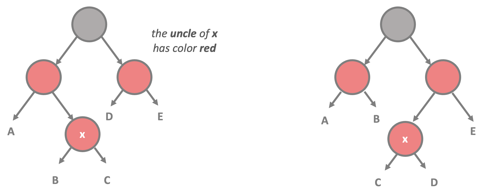

#### Sources : Algorithms and Data Structures in Python (by Holczer Balazs on Udemy)
 

---

## __Red-Black Tree__
 

### __1) Overview and Characteristics__
 

* This data structure has a guaranteed $ O(logN) $ running time

* AVL trees are faster than red-black trees because they are more rigidly balanced but needs more work, however, it is faster to construct a red-black tree

* Each node is either red or black 

* The root node is always black

* All lead nodes (NULL pointers) are black

* Every red node must have two black child nodes and no other children – it must have a black parent

* Every path from a given node to any of its descendant NULL nodes contains the same number of black nodes

 

### __2) Red-black Tree Rotations__

* We have to track the red-black properties for all the nodes in the binary search tree and make rotations if necessary to rebalance search trees

* Left rotations - negative balance factors means right heavy situation so we have to make a left rotation to rebalance the tree

* Right rotations - positive balance factors means left heavy situation so we have to make a right rotation to rebalance the tree

 

### __3) Time Complexity Comparison__
 

| Operations         | Average-Case | Worst-Case |
|--------------------|--------------|------------|
| space complexity   | $ O(N) $     | $ O(N) $   |
| insertion          | $ O(logN) $  | $ O(N) $   |
| deletion (removal) | $ O(logN) $  | $ O(N) $   |
| search             | $ O(logN) $  | $ O(N) $   |

### __4) Insertion Cases__
 

* Case 1 __(before)__

&ensp;&ensp; - The x node will be the root node
 
&ensp;&ensp; - And recolor the children of x to black
 
&ensp;&ensp; - We have to check the properties recursively starting with x up to the root node in $ O(logN) $ running time

 

* Case 1 __(after)__

 

* Case 2 __(before)__

&ensp;&ensp; - We have to make a left/right rotation on the parent of node x
 
&ensp;&ensp; - We have to check the properties recursively starting with x up to the root node in $ O(logN) $ running time

 

* Case 2 __(after)__

 

* Case 3 __(before)__

&ensp;&ensp; - We have to rotate the grandparent of node x to the right/left and recolor
 
&ensp;&ensp; - We have to check the properties recursively starting with x up to the root node in $ O(logN) $ running time

 

* Case 3 __(after)__

 

* Case 4 __(before)__

&ensp;&ensp; - We have to move node x to the grandparent and recolor the children of grandparent node
 
&ensp;&ensp; - We have to check the properties recursively starting with x up to the root node in $ O(logN) $ running time

 

* Case 4 __(after)__

 

---
